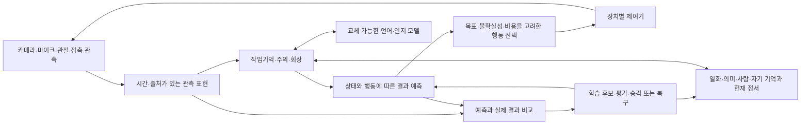

# 비비: 하드웨어에 들어가는 뇌 구현 계획

2026-09-11. 상태: 계획과 현행 코드 대조. 아래 단계의 runtime 구현·학습·하드웨어 검증을 이번 문서 작성으로 완료 처리하지 않는다.

> **후속 전체 감사 반영**: 지금 수행할 세부 순서와 현재 증거는 [R&D 상세 우선순위](BIBI_RD_PRIORITY_PLAN_2026-09-11.md)가 정본이다. 특히 아래 P3의 로컬 embedding 부분을 회상 복구로 앞당기고, 고정 성공 판정 교정을 무인 활동보다 먼저 한다. P4 몸/센서 계약 준비와 J1 E3 review는 운영 복구와 독립적으로 준비한다. 아래 P0–P6은 상위 목표 구분으로 남긴다.

## 목표와 운영 조건

최종 산출물은 로봇의 센서에서 경험을 받아 기억하고, 행동을 선택하고, 실제 결과로 다음 행동을 개선하는 비비다. 개발 PC가 꺼져 있어도 다른 켜진 장치에서 실행할 수 있고, 모든 장치가 꺼질 때에는 저장한 상태에서 재개할 수 있어야 한다. 클라우드와 외부 AI 모델은 선택 가능한 보조 자원이다.

- C에 대형 설치·영상·모델·Docker 이미지를 추가하지 않는다. 코드와 작업물은 E, 빌드·캐시는 위치와 여유 공간을 확인한 E/D 또는 별도 장치에서 생성한다.
- 2027년 2월 집 PC로 프로젝트·기억·학습 자산·실행 상태를 함께 옮긴다. 새 PC의 CPU/GPU·OS에 맞춘 runtime 차이는 설정/adapter로 한정한다.
- 마감 9월 16일은 **worker 모델 배정 규칙의 만료일**이다. Physical AI 뇌 완성 일정을 그 날짜로 약속하지 않는다.
- 현재 사용할 별도 상시 장치와 최종 로봇 사양은 미정이다. 장치 구매·유료 서버 개설 없이 가능한 설계·기능 분리·offline 검증을 먼저 수행한다.

## 뇌 구조: 기존 설계를 유지하면서 연결을 완성

기준은 2026-09-06 Bandi 설계의 **다섯 저장소·두 층·세 신호·수면 단계**다. 이는 기능을 나누기 위한 신경과학 참고 설계이며 사람 뇌의 구현 완료나 생물학적 동등성 주장이 아니다. 영상 하나를 근거로 이를 전면 교체하지 않는다.

이 그림은 목표 연결이다. 아래 표가 현재 구현 여부의 기준이다.

| 부분 | 맡을 일 | 현재 근거와 남은 연결 |
|---|---|---|
| 의미 저장소 | 사물·개념·사람에 관한 지식 | `Concept`, `Person`과 관계가 있다. `Schema`·`Trait` 확장은 설계 단계 |
| 일화 저장소 | 누가·언제·어떤 관측/행동/결과를 겪었는지 | `Experience`, `INVOLVES`, 화자·시각·정서 속성이 있다. 사건 묶음·유효기간·충돌 수정은 미완료 |
| 관계 저장소 | 사람별 경험·신뢰·상호작용 | `UserModel`, `Person`, `FEELS_ABOUT` 일부 구현. 계획의 모든 사회적 추론이 구현된 것은 아님 |
| 자기 저장소 | 상태·능력·목표·자신의 경험 | `BabyState`와 목표 관련 구조가 있다. 이것이 실행 가능한 행동 정책을 보장하지 않음 |
| 현재 정서 상태 | 기억 우선도·주의에 쓰는 상태 | gateway에 valence/arousal과 Redis 캐시 경로가 있다. 일부 상태는 프로세스 메모리에만 존재 |
| 집행·작업기억 층 | 지금 필요한 기억을 찾고 무엇을 할지 결정 | A단계 회상 gateway·세션 버퍼·FOK/conf 구현. 장기 계획·행동 선택·재시작 연속성은 별도 검증 필요 |
| 절차·가치 층 | 행동의 결과를 예측하고 유용한 행동을 학습 | Procedure/Prediction 구조·연구 코드가 있으나 센서 기반 action→outcome 정책은 미검증 |
| 조절 신호 | 놀람, 보상 예측오차, 불확실성이 학습·탐색을 조절 | z 기반 놀람 gate는 A단계 구현. 나머지 설계 신호 전체가 구현됐다고 취급하지 않음 |
| 수면·재생 | 경험 재사용과 검증된 기억/모델 갱신 | replay와 distill 코드가 존재. 전체 수면 6단계·안전한 지속 자기개선은 미완료 |
| 몸 인터페이스 | 관측을 받고 명령을 실행·측정 | Quest 수신 계약과 NEXT_FRAME 계측 경로가 있다. 로봇 탑재·실물 행동 학습 증거는 없음 |

다섯 저장소는 논리적 구분이며 DB 다섯 개를 새로 설치하자는 뜻이 아니다. Neo4j는 기억을 담는 현재 저장 기술이고, 기억 규칙·예측·학습 알고리즘이 비비의 동작을 결정한다. 최종 하드웨어가 정해지기 전 저장 기술부터 바꾸지 않는다.

## 현재 병목의 우선순위

1. **실행 연속성**: `/sleep` 페이지의 `MemoryConsolidationCard` → `useIdleSleep`가 수면을 시작한다. API lifespan에는 독립 실행기가 없다. UI를 닫으면 자동 활동 타이머가 사라진다.
2. **기억의 재사용**: 9월 7일 같은 프로세스의 회상은 성공했지만 새 프로세스 시나리오는 기준 미달이었다. `.env`의 `MEMORY_GATEWAY` 활성화도 별도로 확인해야 한다. 재시작 후 회상/상태 계약과 의미 검색 경로가 필요하다.
3. **외부 모델 의존**: 대화는 Gemini, 임베딩은 OpenAI다. 로컬 모델을 붙일 경계와 네트워크 없이 동작하는 검증이 필요하다.
4. **학습과 행동의 연결**: 로컬 LoRA 학습 코드가 있어도 현 대화 생성에 직접 사용되지 않는다. 기존 causal-LM replay와 relevance 평가 목적 불일치, J1 E3 라벨 검토·후속 계약은 해결되지 않았다.
5. **외부 결과**: 자신의 생성 문장이나 상태 문자열을 바꾸는 것은 실제 환경에서 배운 증거가 아니다. action ID·예측 시각·센서/사용자 결과를 연결해야 한다.

## 단계별 실행과 완료 조건

각 단계는 기간 추측 대신 통과 조건으로 끝낸다. 구현은 한 checkout에서 한 담당자가 수행하고, 읽기 검토는 다른 worktree에서 별도로 한다. worker는 명시 요청 없이 commit/push/merge하지 않는다.

| 단계 | 실제 작업 | 주 작업 파일/산출물 | 끝났다고 말할 조건 | 선행 조건 |
|---|---|---|---|---|
| P0 상태 보존 | DB·모델·설정·실행 경로 인벤토리, 일관된 백업, 빈 복원본 비교 | 기존 `preflight.py`, backup manifest, 복원 검증 기록 | 노드/관계 유형·속성·ID·인덱스·학습 파일 해시를 비교한 복원 리허설 성공 | 대상 저장 공간, 백업을 위한 DB 정지/읽기 일관성 방식 결정 |
| P1 독립 실행 | Redis local/TLS 설정 분리, 실제 DB/Redis readiness, UI 없이 실행되는 lifecycle, 시작·종료·재개 상태 | `redis_client.py`, `api_server.py`, 작은 runtime 모듈, `scripts/deployment/`, 관련 `tests/` | 브라우저 없이 상태 조회/이벤트 동작; 재시작 후 계약상 상태와 기억 조회 유지; 중복 worker 기동 거부 | P0, 단일 쓰기 주체 |
| P2 제한된 무인 활동 | 실제 실행 가능한 활동 목록, 새 경험/진행 근거 확인, durable 작업 ID·cursor·기록, 횟수/시간 상한, UI 중복 호출 제거 | runtime worker, 상태 저장 계약, `useIdleSleep` 호출 제어 | UI 종료 중 허용 작업 실행; 신규 입력 없을 때 같은 데이터 무제한 강화 없음; 실패/재시작 후 중복 처리 없음 | P1, 활동 범위 확정, 복원본에서 검증 |
| P3 로컬 모델 경계 | 언어 모델 adapter와 embedding provider 분리; 기존 호출부 계약 유지; local provider 선택 | `llm_client.py`, `embeddings.py`, gateway 저장 경계, provider tests | 고정된 질의/회상/실패 표본에서 provider 비교; 외부 통신을 차단한 실행으로 지원 기능 검증; 지연·메모리 기록 | 대상 장치 자원 확인, 모델별 사용 조건·다운로드 위치 결정 |
| P4 경험→행동 계약 | 관측·행동·결과 스키마, 실행 전 예측 봉인, 센서 시각/누락/중복 처리, 제한된 첫 과제 | endpoint/db 밖 새 계약 모듈, 센서·제어 adapter, offline tests | action과 실제 outcome의 순서·출처 검증; 고정 baseline과 비교할 유효한 데이터 확보 | P1, 구체적 몸/과제 선택; J1/B5 기존 제한 준수 |
| P5 학습 코어의 실제 영향 | task-aligned 목표·데이터 분리·base 비교; 학습된 모델을 제한된 행동 선택에 연결; checkpoint 승격/복구 | J1 E3 후속 계약, 별도 학습/평가 스크립트와 versioned checkpoint | 사전 고정한 미사용 평가에서 baseline 대비 개선·기존 능력 유지; 실패 후보는 승격 안 됨 | E3 사용자 review, 후속 학습 계약, P4의 유효 outcome; 성능 확인 전 held-out 조기 사용 금지 |
| P6 장치 탑재·이전 | 선택 장치에 패키지와 기억/모델 복원, 센서·제어 연결, 인터넷/개발 PC 분리 시험, 집 PC 이전 리허설 | 배포 묶음, restore manifest, 장치별 설정, 운영 기록 | 실제 장치에서 승인된 과제가 동작하고 개발 PC 없이 기록이 남음; 전원 재기동/이전 후 상태 복원 확인 | P0–P4의 지원 범위 충족; 자기학습 주장에는 P5 별도 통과 |

P6의 **상시 실행 장소 이전**은 모든 학습 연구가 끝나기 전에도 할 수 있다. 그 경우 보고는 '대화·기억 기능이 별도 장치에서 실행됨'으로 한정한다. Physical AI 자기학습 완료는 P4–P5의 실물 근거가 있어야 한다. P3의 API 독립성과 P5의 학습 성능은 별개로 측정한다.

## 바로 다음 구현 묶음

첫 구현 범위는 **P0 준비 + P1의 최소 경계**다. 외부 서버 계약, 새 뇌 모델 학습, live graph repair부터 시작하지 않는다.

1. 현재 source manifest와 backup 계획을 확정한다. C에 이미지/모델을 받지 않는 검사를 실행 경로에 둔다. 현재 preflight는 읽기 점검만 통과했으며 백업 자체는 아직 없다.
2. Redis의 `redis://`와 `rediss://` 연결 옵션을 분리하고 local/TLS 두 경로를 단위·연결 검증한다. Neo4j/Redis가 실제로 준비되지 않았으면 readiness가 성공으로 표시되지 않게 한다.
3. UI와 독립된 runtime의 `start/stop/status` 및 상태 스키마부터 구현한다. 이 단계는 가동 여부와 복구를 검증하며, 임의의 그래프 학습을 주기 실행하지 않는다.
4. 새 프로세스에서 같은 장기 기억을 회상하는 시나리오를 고정한다. 현재 임베딩 인덱스 이름/차원/모델 metadata와 실제 저장 상태를 확인하고, semantic retrieval 실패를 일반 관심사 prompt 효과와 구분한다.
5. 이 묶음의 검증 보고를 읽기 reviewer에게 전달한 뒤 P2의 구체적인 무인 활동을 연결한다.

보호 대상 `conversation_handler.py`는 현재 제약대로 유지한다. 모델 provider는 기존 `llm_client.py` 경계에서, 실행 lifecycle은 endpoint/runtime 층에서 작업한다. 새로운 함수를 만들면 실제 호출 지점도 확인한다.

## 변경할 때 반드시 지킬 기술 계약

- Embedding 모델을 바꾸면 차원·벡터 공간이 달라질 수 있다. 기존 1536차원 벡터와 새 벡터를 한 인덱스에서 혼용하지 않는다. `provider/model/revision/dimension` metadata와 별도 속성/인덱스로 비교하고 검증 후 전환한다. 기존 검색과 rollout 복구 경로를 남긴다.
- 모델 이전 묶음은 adapter만 포함하지 않는다. 대응하는 base model revision·weights, tokenizer·설정, adapter, 학습/평가 manifest의 연결을 해시로 기록한다. `.venv`와 `node_modules`는 그대로 이식할 필수 기억 자산이 아니며 잠긴 의존성 명세로 새 장치에서 재구성한다.
- 프로세스 임시 상태를 모두 영구 보존하지 않는다. 장기 기억, 재개해야 할 상태, 만료해야 할 세션 버퍼를 구분해 재시작 계약을 만든다. 특히 gateway의 σ_c·화자 상태·작업 cursor를 어느 범위에서 이어갈지 명시한다.
- 실제 관측, 사용자 답변, 모델 생성, 상상을 provenance로 구분한다. `explore_batch`가 `learned`로 바꾼 기존 값은 자동으로 학습 성공 근거가 되지 않는다.
- 무인 replay는 시간마다 같은 최고-salience 경험을 끝없이 강화하는 루프로 만들지 않는다. 대상 기록, 처리 예산, 새 경험/평가 근거, 작업 idempotency와 전후 snapshot을 요구한다.
- 무거운 모델 추론과 모터의 주기 제어는 분리한다. 센서 누락·연산 지연·네트워크 단절 시 장치 제어기가 정해진 정지/유지 동작을 수행하도록 몸 계약에서 검증한다.
- Neo4j Desktop Enterprise의 실제 store format과 대상 edition 호환성은 아직 미확인이다. DB 폴더를 실행 중 단순 복사하거나 동일 내부 ID를 가정해 이전하지 않는다.
- API를 로컬 모델로 대체했다는 이유로 기존 `LOCAL_CORE_DISTILL=0`, E3 review, 평가 분리·lockbox·production gate를 해제하지 않는다.

## 영상 검토와 worktree 배정

- 영상: https://www.youtube.com/shorts/u98cx_ZtPoY
- 지정 worker: `gpt-5.6-sol`, reasoning `high`.
- 별도 worktree: `E:/A2A/our-a2a-project/.worktrees/video-brain-20260911`, branch `review/brain-video-20260911`.
- 작업: 실제로 확보한 영상/소리/자막/화면 근거를 명시하고 timestamp별 주장, 확인 사실, 미확인 사항, 비비에 적용/보류할 아이디어를 보고한다. 제목/메타데이터만 보고 영상을 봤다고 쓰지 않는다.
- 현재 접근 가능한 설치에서 `/watch` 명령은 찾지 못했다. 동등한 근거 확인 절차를 맡겼으며 정확한 `/watch` 실행을 했다고 주장하지 않는다.
- Claude worker가 필요할 경우 2026-09-16 23:59 KST까지 사용자가 요청한 `opus5`만 배정한다. 이 작업에서는 Claude를 실행하지 않았다. CLI 모델 별칭의 실제 지원 여부는 필요한 시점에 확인하며 불가 시 알린다.
- 영상 결과는 아래 수신 기록에 반영한다. 영상의 주장만으로 신경과학 사실·비비 성능·새 구조의 우월성을 확정하지 않는다.

### 영상 수신 기록

2026-09-11 검토 완료. 요청한 `gpt-5.6-sol/high` worker가 별도 worktree에서 실제 19.521초 파일을 취득하고 전 구간 1초 간격 화면과 2초 간격 원해상도 프레임을 검사했다. 부모는 보고서·manifest·영상 식별 metadata를 읽고 주요 원천 파일 네 개의 SHA-256 일치를 독립 확인했다.

- 보고서: [영상 검토](../../.worktrees/video-brain-20260911/claudedocs/video_review/VIDEO_u98cx_ZtPoY_REVIEW.md). 증거·명령·한계: [manifest](../../.worktrees/video-brain-20260911/claudedocs/video_review/EVIDENCE_MANIFEST.md).
- 보존 경로: repo 루트의 `.worktrees/video-brain-20260911/claudedocs/video_review/`. 보고서 SHA-256 `6e0da0f49f9a34c3dc6c930c7d2ad36b79837d4278aa3be4bc4acaaa2d9c62d0`, manifest `c7b80214bc998fa7c4bd723648869af84cca6c1f3a8b802ef27fc82ccd35e94b`.
- 화면 자막은 새 경험·반복 학습에 따른 신경 연결 변화를 설명한다. 적어도 세 개의 다른 현미경 클립이 편집돼 있으나 원 실험, 종·조직, 촬영 시간축은 제시되지 않았다. 사람의 뇌에서 학습하는 순간을 실시간 촬영했다는 해석은 **확인 안 됨**이다.
- 경험에 따른 연결 변화라는 일반 취지는 [NIH의 Plasticity and Learning](https://www.ncbi.nlm.nih.gov/books/NBK20367/)과 부합한다. 강화뿐 아니라 약화도 포함한다는 점은 [Queensland Brain Institute](https://qbi.uq.edu.au/memory/how-are-memories-formed/)로 교차확인했다. 이 자료들이 영상 속 실험의 출처를 인증하는 것은 아니다.
- YouTube 제공 자막은 없었고, 기존 설치 Whisper·기존 캐시 모델의 음성 전사는 품질 검증에 실패해 제외했다. 화면 자막과 음성 발화의 확인 범위를 구분하며 정확한 음성 내용은 미확인이다. 새 설치·모델 다운로드는 없고, 새 영상과 산출물은 E에만 저장했다.
- 계획 반영: P4–P5에서 **외부 경험 → 지속적인 내부 변화 → 이후 예측/행동 개선**을 함께 검증한다. 반복 횟수·연결 수 증가만으로 학습 성공을 선언하지 않는다. 강화와 약화/한도·출처·복구를 함께 설계하되, 적용 규칙은 별도 검증한다. 기존 다섯 저장소 구조와 학습 제한을 영상 때문에 바꾸지 않았다.

## 판정과 필요한 선택

- 계획 완료와 실제 구현/상시 가동 완료를 분리한다. 전체 상시 운영 미완료 조건은 `GATES.md`에 남아 있다.
- 사용 가능한 별도 연산 장치와 최종 몸의 입력/출력은 장치 선택 전에 확인한다. 일반 MCU만으로 현재 전체 stack이나 로컬 언어 모델이 실행된다고 가정하지 않는다.
- 첫 physical 과제는 몸이 정해진 뒤 작게 고른다. 예를 들어 시선 방향을 바꾼 뒤 대상이 보이는지 예측하는 과제를 후보로 둘 수 있지만, 사용자의 실제 센서·구동계 없이 채택·실행했다고 기록하지 않는다.
- C 공간 정리·기존 DB 종료·클라우드 결제·모델 다운로드·실물 구동은 이 계획 작성으로 실행된 것이 아니다.

## 코드와 설계 근거

- `AGENTS.md`: A0/A 구현 상태, J1 E3와 B5 제한, 로봇 이식 목표.
- `neural/baby/memory_gateway.py`: 현재 회상·작업 버퍼·놀람·정서 경로.
- `neural/baby/api_server.py`: lifecycle, memory replay, curiosity 상태 변경.
- `frontend/baby-dashboard/src/components/MemoryConsolidationCard.tsx`, `src/hooks/useIdleSleep.ts`: 30분 idle에 의존한 UI 수면.
- `neural/baby/conversation_handler.py`, `llm_client.py`, `embeddings.py`: 현재 외부 모델 호출 경계.
- `scripts/research/sleep_distill_job.py`, `llm_core_distill.py`: local trainable core는 연구 경로에 존재. 과거 스크립트의 성능 표현은 최신 AGENTS의 감사 결과로 제한한다.
- `docs/QUEST_APK_CONTRACT.md`: 관측 시각·pose/depth·NEXT_FRAME 계약.
- `claudedocs/research/MEMORY_GATEWAY_A0_A_2026-09-06.md`: 9월 7일 같은 프로세스/새 프로세스 회상 결과.
- Bandi `A2A/비비 다음 뇌 설계 — VoiceMem 좌·우뇌를 넘어서 (2026-09-06).md`: 다섯 저장소·두 층·세 신호의 설계 원본. 본 문서는 논문 재검증이나 신규 신경과학 연구를 수행한 보고서가 아니다.
