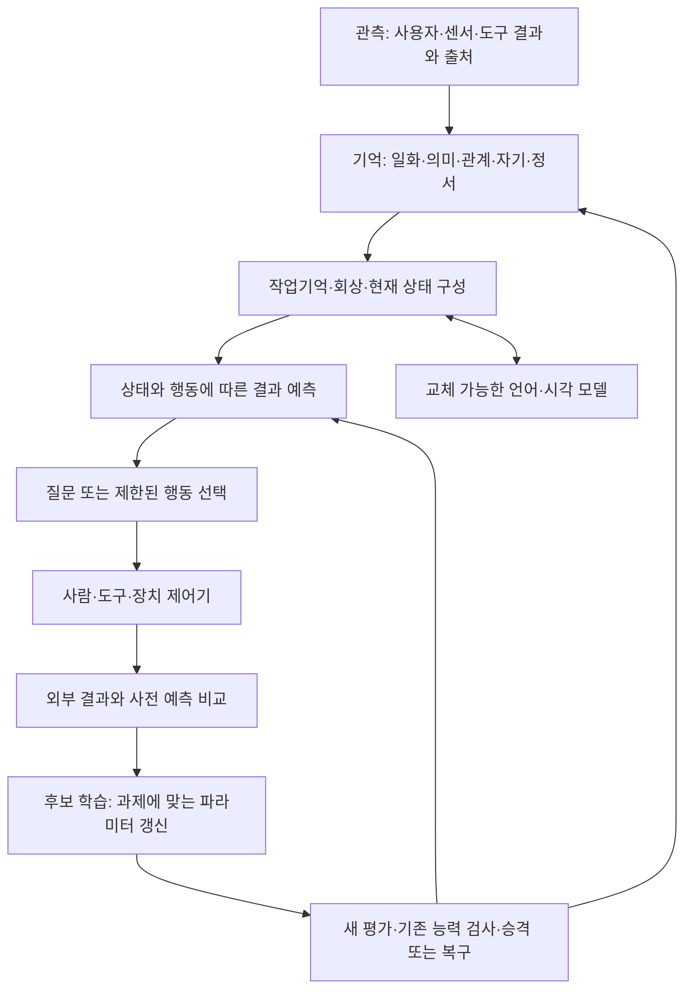

# 비비 연구·개발 현황 감사와 상세 우선순위

2026-09-11 KST · 기준 checkout `DB_Renewal`, HEAD `1a2d0d7` + 작업 중인 운영 계획 문서.

**권고: 기억 보존 → 실행·성공 판정의 정확성 → 재시작 후 회상 복구를 먼저 끝낸다. 동시에 J1의 검토·학습 목표를 정리하고, 센서 과제의 데이터 계약을 준비한다. 학습 코어를 다시 돌리는 것은 그 다음이다.**

이 문서는 앞선 [하드웨어 뇌 계획](BIBI_HARDWARE_BRAIN_PLAN_2026-09-11.md)의 P0–P6을 전체 연구 상태와 대조한 상세 실행 순서다. 아래 W 번호는 작업 묶음 식별자이며 기존 Phase/J1/B5 번호를 대체하거나 해당 실험을 완료 처리하지 않는다. 이번 작업은 읽기 감사와 계획 작성이다. runtime 수정·DB 쓰기·학습·실물 구동은 실행하지 않았다.

## 1. 판단 기준과 실제 확인 범위

증거 등급을 다음처럼 구분한다.

- **현행 실측**: 이번 세션에서 읽기 쿼리·연결 점검·파일 해시로 확인.
- **코드 확인**: 실제 호출 경로와 구현을 읽음. 그 경로의 실행 성공을 뜻하지 않는다.
- **과거 실행 기록**: 당시 JSON/보고서에 남은 결과. 이번에 실험을 재실행하지 않았다.
- **계획/미검증**: 구현 제안 또는 아직 성능·실물 근거가 없는 부분.

살펴본 범위는 실행 lifecycle, 대화→gateway→검색→저장, Redis/SSE, 수면·상상·호기심, graph update, J1/B5의 최신 artifact, 로컬 학습 스크립트, Quest 수신/프레임 연결, 패키징 명세다. 저장소 모든 파일의 정밀 코드 리뷰나 신규 문헌 서베이는 아니다. Bandi의 9월 6일 뇌 설계는 설계 배경으로 사용하고, 문헌 주장을 이번에 새로 검증한 것으로 취급하지 않았다.

재현 가능한 근거:

- [현재 인프라 점검](preflight_rd_audit_2026-09-11.json): 2026-09-11 14:14 KST 무렵. Neo4j 인증/조회, 포트, 디스크, 버전.
- [연구·개발 상태 집계](rd_state_audit_2026-09-11.json): 읽기 쿼리 원문, 결과, 기능 플래그, 소스 해시, 과거 artifact 요약, 기존 E5 파일 검증. 사용자 대화 원문과 비밀값은 내보내지 않았다.
- 해당 집계 SHA-256: `7b9259a01a811b23759565811413a46f24a12572aa2f1970ae6ecd63e287afcf`.
- 이번에는 pytest·대화·모델 추론을 실행하지 않았다. 과거 테스트 통과 수를 현재 checkout의 통과 수로 재사용하지 않는다.

## 2. 전체 상태: 무엇을 갖고 있고 무엇이 빠졌나

| 영역 | 현재 확인한 사실 | 판단 | 바로 이어질 작업 |
|---|---|---|---|
| 실행 기반 | Neo4j Enterprise 2026.03.1 인증·조회 정상. Redis DNS 실패, API 8000 연결 거부 | 저장소는 살아 있고 서비스는 복구 필요 | W1–W2 |
| 디스크·이전 | 이번 점검 C 여유 2.39 GiB, D 1,581.34 GiB, E 1,037.08 GiB | 대형 작업은 E/D. 프로젝트 경로와 별개인 패키지/model/Docker 캐시 위치도 확인 필요 | 전 단계 공통, W1/W9 |
| 장기 기억 | 전체 노드 9,753 / 관계 10,852. Experience 3,157 / Concept 1,122 / Person 5 / UserModel 6 | 데이터 존재 확인. 백업·완전성·복원 성공은 아직 아님 | W1 |
| 회상 gateway A0/A | 호출 지점은 handler의 답변 생성 전과 endpoint의 답변 후에 존재. 현재 `.env`+감사 프로세스에서 `MEMORY_GATEWAY` 미설정으로 기본 OFF | 구현·merge 완료와 실제 활성 상태가 다름 | W3 |
| 장기 경험의 의미 검색 | 대화 Experience 1,508건의 embedding 0. 전체의 106개 벡터는 모두 1536차원이며 대부분 이전 코드 작업 경험 | API 크레딧 복구만으로 대화 회상이 해결되지 않음 | W3 |
| 검색 인덱스 | 코드의 `experience_embeddings` 조회는 이번 읽기 probe에서 실패. DB의 실제 Experience 벡터 인덱스 `index_2bacf740` 조회는 같은 저장 벡터로 1건 반환 | 인덱스 이름 계약이 깨져 있음. 이름 수정과 내용 보강은 별개 | W2 진단/W3 복구 |
| 화자별 기억 | Experience 최상위 `speaker_id` 속성은 0건이지만 `INTERACTED_WITH→UserModel` 연결은 56건. 연구 question의 식별자는 별도 속성/관계 계약 | 속성이 없다는 이유로 화자 정보 전부 소실로 단정하면 안 됨. 미연결 과거 경험을 누구 것으로 할지도 임의 결정 금지 | W3 |
| 최근/오래된 회상 | gateway는 화자별 최근 20건을 먼저 고르고, 벡터 검색 결과도 그 안에 있는 ID만 채택 | 좋은 embedding만 붙여도 최근 20건 밖의 기억은 회상 못할 수 있음 | W3 후보 검색 순서·범위 수정 |
| Phase 1 그래프 가소성 | 과거 256-event prequential JSON에서 additive MRR 0.4938, RW 0.5107, EdgeBank 0.4255. 별도 shuffle 통제 기록 존재 | 제한된 offline 시간 예측 신호. 현재 live `hebbian_update`는 양성 가산·cap 규칙이라 RW가 운영 중인 것은 아님 | 기존 baseline 보존, W7 비교 후보 |
| Phase 2 로컬 코어 | Qwen0.5B/LoRA 학습·저장·일일 gate·수면 hook 코드 존재. pair-disjoint 수정도 존재 | 이전 MRR은 누수/목표 불일치 감사로 탐색 증거. 실제 wake 행동 개선 미검증 | W5→W7. `LOCAL_CORE_DISTILL` OFF |
| J1 관련성 평가 | 고정 1,069 concept·12 development 질문에서 lexical Recall@8=0, frozen E5=0.5, E5 nDCG@8=0.2910 | 의미 신호는 있으나 6/12만 top-8 성공. 개발 결과이며 자기학습·held-out 성능 아님 | W5 |
| J1 E3 검토 | primary 60행, 별도 진단 24행. 상태는 아직 agent proposal. primary 제안 중 context 52/60 | 관련 개념을 모두 negative로 학습하면 오히려 의미 이웃을 억제할 수 있음 | 사용자 review→학습 계약 |
| B5 질문→결과 | PendingQuestion 24개 중 연구 action key·사전 예측·외부 outcome·split을 가진 것은 각각 6개. B5.9의 25개 의미 target은 과거 사용자 검토 완료 | 구조·라벨 근거는 남아 있음. 같은 6개 train이며 예측 성능이나 새 평가 증거는 아님 | W5 데이터 계약 재사용 |
| 호기심 | learning-progress 계산·일부 endpoint 배선 존재. B5의 source-aware ranker도 기존 6개에서 top-8 hit 0 | 임계값을 바꾸거나 같은 pilot을 반복할 근거 없음 | target/표현/coverage부터 해결 |
| 상상·월드모델 | `/api/imagination`의 predict는 고정 문장+confidence 0.6, simulate는 즉시 completed/reward 0.6, verify는 `was_correct=True`를 전달 | endpoint 존재가 학습된 world model이나 실제 성공 판정 증거가 아님 | W2에서 성능 통계 오염 방지 |
| 수면·무인 활동 | UI의 idle hook이 consolidate/replay/curiosity/imagination을 호출. replay는 같은 고감정 기억을 다시 강화할 수 있음. explore는 상태만 learned로 변경 | 이 호출 묶음을 그대로 서버 타이머로 옮기면 근거 없는 성공과 반복 강화가 늘어남 | W2→W8 |
| 감정·자기·사회 모델 | BabyState/정서 값·사용자 모델·FEELS_ABOUT·gateway 우선도 조절 코드 존재 | 기능 일부는 실행 경로에 있음. 뇌 부위 수/정서 이름이 생물학적 타당성이나 학습 효과를 증명하지 않음 | W3 기능 복구, W7 소거 비교 |
| 감각·신체 | vision Experience 45, NEXT_FRAME 36. head_pose/depth_bins/pose_delta는 0. 마지막 vision은 5월 12일 | 수신 경로 준비와 실제 감각운동 데이터 확보를 구분해야 함 | W6 |
| 온디바이스 모델 | E5 snapshot 9파일/492,795,290 bytes를 E에서 다시 검증, 해시 모두 일치. 현재 대화는 Gemini, embedding 생성은 OpenAI 경로 | 기존 E5를 검토 후보로 재사용 가능. 완전 오프라인 비비는 아직 없음 | W3 embedding 우선, W9 언어·음성·시각별 독립성 |
| 실행 재현성 | pyproject에 FastAPI 직접 의존성 없음, wheel packages=`agents,hosts,common`으로 `neural` 제외, Python lockfile 없음 | 현재 venv에서 실행 가능하더라도 새 PC 설치 성공이 보장되지 않음 | W1에서 재현 묶음 정리 |

추가 해석 주의:

1. Prediction은 총 23개이고 `was_correct`가 있는 5개 모두 true다. 이것만으로 정확도 100%라 할 수 없다. 어느 API가 과거 각 행을 만들었는지도 이번 집계로 확정하지 않았다.
2. B5 연구 필드는 `question_outcome_policy_action_key`, `predicted_concept_ids`, `prediction_captured_at` 등이다. 일반 이름 `policy_action_id`/`prediction_snapshot`가 0이라고 연구 pilot까지 없다고 판단하지 않는다.
3. Phase 1 보고서의 반올림/다중시드 요약과 단일 JSON의 값이 조금 다르다. 위 표는 명시한 원 JSON의 단일 실행 값이다. 다른 과제의 J1 MRR과 직접 비교하지 않는다.
4. 7월 평가 universe 1,069개와 현재 DB 1,122개는 같은 집합으로 간주하지 않는다. 개수 차이만으로 새 concept의 정확한 ID 집합도 알 수 없다.

## 3. 우선순위를 바꾸는 핵심 발견

### 3.1 '기억이 사라졌다'와 '기억을 못 꺼낸다'를 분리한다

현재 확인한 문제는 Neo4j 전체 소실이 아니다. Redis 연결 실패, gateway 기본 OFF, 대화 벡터 부재, 인덱스 이름 불일치, 최근 20건 후보 제한이 각각 존재한다. 따라서 Redis 재생성이나 OpenAI 결제 하나로 모든 회상이 복구될 것이라고 약속하지 않는다. 백업 후 각 원인을 독립 검증한다.

W3의 목표는 단순히 이름을 기억하는 답변이 아니다. **재시작한 새 프로세스가 올바른 화자의 오래된 경험 ID를 실제로 찾고, 근거에 없는 답은 기권하는 것**이다. 외부 LLM이 일반 상식으로 맞힌 답을 회상 성공으로 세지 않는다.

### 3.2 무인 실행 전에 잘못된 완료 판정을 막는다

`explore_batch`의 learned 전환, imagination의 고정 reward/정답 처리, 항상 healthy인 health endpoint는 자동화에 직접 영향을 준다. 서비스가 계속 켜져 있다는 사실과 비비가 배우고 있다는 사실을 같은 통계로 표시하면 개발 방향을 오판한다.

기존 데이터를 삭제하거나 전부 재라벨하지 않는다. 새 작업부터 execution status, evidence status, measured outcome을 구분하고, 출처가 불충분한 기존 행은 연구 성능 집계에서 제외할 기준을 만든다. 실패·미실행·결과 대기를 실제 상태로 남긴다.

### 3.3 연구의 다음 단계는 E3 review와 과제에 맞는 학습이다

기존 LoRA가 학습한 것은 그래프 이웃 이름의 replay이고, J1이 묻는 것은 자연어 질문에 맞는 concept의 관련성이다. 더 오래 학습한다고 이 불일치가 사라지는 것은 아니다. E3 라벨 검토 후 무엇을 positive/context/negative로 삼을지 먼저 정하고, 고정 encoder+작은 관련성 head가 배울 수 있는 데이터가 있는지 판단한다.

E5 경험 검색 복구(W3)와 J1 concept 관련성 학습(W5/W7)은 입력·정답·평가 집합이 다르다. J1의 0.5 Recall@8을 개인 경험 검색의 예상 성능으로 사용하지 않는다. 검색을 고치는 것은 운영 기능이며, 비비가 스스로 학습했다는 주장은 별도 검증한다.

### 3.4 감각 데이터는 수량보다 먼저 단위·순서·행동 출처를 고정한다

현재 NEXT_FRAME은 직전 vision의 수신/저장 시각과 30초 간격으로 연결하며 device/session 경계가 쿼리에 없다. pose_delta도 위치 3개와 quaternion 4개를 한 벡터로 L2 계산한다. 이는 미터와 회전 성분을 섞고, 같은 회전인 q와 −q를 다른 움직임으로 볼 수 있다.

따라서 APK에 pose만 추가해 대량 수집하기 전에 W6에서 좌표계, 위치 거리(m), 회전 차이(rad), capture/receive time, device/session/frame ID, 행동 주체를 고정한다. 사람이 Quest를 움직인 데이터는 사람이 수행한 행동으로 기록하고, 비비의 자율 행동 성공으로 세지 않는다. 화면 위치를 이용한 depth 근사도 실측 depth와 별도 출처다.

## 4. 뇌 구조의 개발 순서

기존 **다섯 저장소·두 층·세 신호**의 설계 구분은 유지한다. 신규 DB 다섯 개를 설치하거나 뇌 부위마다 서비스를 나누지 않는다.

| 설계 부분 | 지금 할 범위 | 뒤로 미룰 범위 |
|---|---|---|
| 일화·의미 기억 | W3: ID·화자·출처·인덱스·재시작 회상. 학습 없이 검증 | B의 유효구간/수정 이력, Episode, ACT-R 순위는 회상 baseline 후 별도 증분 |
| 관계·자기·정서 | 실제 저장된 정보와 세션 상태 구분, 권한 범위 및 재개 정책 | Trait·복합 사회 추론·음성 화자 인증을 한 번에 추가하지 않음 |
| 집행·작업기억 층 | bounded 후보 검색, 이유/회상 ID 추적, 작업 상태 | 복잡한 장기 계획·자율 권한 확대 |
| 절차·가치 층 | W6: 한 과제의 상태·행동·결과와 예측 계약 | W7 이전에 습관·가치 함수를 실물 행동에 자동 적용하지 않음 |
| 세 조절 신호 | 놀람과 실제 learning-progress를 구분하고 로그로 관찰 | z의 자카드 오차, 수면 coverage 분모, social_salience 상수 문제를 검토하기 전 조절기 확대 금지 |
| 수면 6단계 | W8a: 실행 상태·작업 중복·예산, read-only 유지보수부터 | B/C 전체 그래프 재구성, J3 학습 승격은 각각 검증 후 |
| 언어·인지 모델 | W3: 기존 로컬 embedding 후보부터. 외부 모델은 교체 경계 유지 | 새 대형 모델 다운로드·전체 언어 모델 훈련을 초기 필수로 두지 않음 |

회상 A단계에 아직 운영 결함이 있으므로 B→C→D를 달력대로 밀어붙이지 않는다. B의 사실 갱신·기권은 재시작 회상 다음의 유용한 기능 후보지만, C의 자동 graph repair와 J3의 모델 갱신은 같은 작업이 아니다.

## 5. 작업 묶음: 선행 조건·변경 범위·완료 기준

우선순위 P0는 데이터/판정 신뢰성, P1은 현재 사용자 기능과 연구 병목, P2는 검증된 기능의 확장이다. 추정 소요 기간 대신 아래 통과 조건을 사용한다.

| ID | 우선순위 | 작업 묶음 | 선행 조건 | 지금 상태 |
|---|---|---|---|---|
| W0 | P0 | 현재 상태·소스·실험 결과 기준선 | 없음 | 이번 읽기 감사 완료 |
| W1 | P0 | 복구 가능한 백업과 설치 재현 묶음 | W0 | 다음 구현 첫 작업 |
| W2 | P0 | 실제 readiness·Redis 복구·완료 판정 정리 | W1의 복원본 확보 후 통합 시험; 순수 로직 수정은 병행 가능 | 구현 전 |
| W3 | P1 | 재시작·오래된 경험·화자별 회상 복구 | W1, W2; 로컬 embedding 적합성 확인 | 가장 먼저 체감할 기능 목표 |
| W4 | P1 | 평가 환경과 봉인 자료의 재현 기준 | W0 | W1–W3과 독립적으로 준비 가능 |
| W5 | P1 | E3 사용자 검토·관련성 학습 계약 | 기존 E3 60행 제안표, W4 | 검토본은 준비됨, 사용자 최종 라벨 미확정 |
| W6 | P1 | 첫 감각운동 과제·계측·소규모 유효 데이터 | 설계는 지금 가능, 실수집은 W1/W2와 기기 접근 | 기기/APK·과제 확인 필요 |
| W7 | P2 | 과제에 맞는 학습·미래 평가·행동 영향 | J1 경로=W5, 실물 경로=W6; 모두 W4 | 학습/성능 승격 전 |
| W8a/b | P2 | 독립 실행기 / 검증된 자기개선 주기 | a=W2/W3, b=W7와 해당 유지보수 계약 | a와 b의 권한을 분리 |
| W9 | P2 | 다른 장치에서 실행·API 의존 축소·집 PC 이전 | 운영 이전=W1/W2/W3/W8a, 학습 주장=W7 별도 | 2027년 2월 이전 목표 |

### W1. 백업과 재현성 — 먼저 기억을 잃지 않게 만든다

**작업**

1. 현재 Neo4j instance/store 경로·DB 이름·edition/version·데이터 크기와 백업 방식을 기록한다. 가동 중 DB 폴더 단순 복사를 백업으로 쓰지 않는다.
2. E/D에 일관된 백업을 만들고, 원본과 포트/경로가 다른 빈 복원본에서 시험한다. Enterprise store를 다른 edition으로 옮길 수 있다고 가정하지 않는다.
3. application ID·label/type별 수량·핵심 속성·관계 양끝 ID·인덱스/제약을 비교한다. Neo4j 내부 ID 동일성은 이전 계약으로 삼지 않는다.
4. 현재 환경의 패키지 버전을 수집한 뒤 Baby runtime 직접 의존성과 wheel 포함 범위를 정리한다. 연구/GPU 패키지는 별도 선택 묶음으로 둔다. 현재 전체 venv를 그대로 동결해 runtime에 강제하지 않는다.
5. 코드, 설정 템플릿, 비밀의 안전한 전달 방법, DB 백업, base model+revision/tokenizer, adapter, 평가 manifest를 각각 목록화한다.

**변경 파일/산출물**: `scripts/deployment/preflight.py`, 새 backup/restore 검증 도구, `pyproject.toml`과 잠긴 의존성 명세, 복원 manifest. 백업 원본·모델·비밀은 Git에 넣지 않는다.

**완료**: 원본을 건드리지 않은 복원본의 비교 통과 + E/D의 깨끗한 설치 환경에서 Baby runtime import/실행 경계 검증. **중단**: 공간·store 호환성·필수 데이터/모델 누락이면 원본 cutover를 진행하지 않는다.

### W2. 살아 있는 서비스와 신뢰할 수 있는 결과 판정

**작업**

1. `redis://`에는 로컬 연결 옵션, `rediss://`에는 TLS 옵션을 적용한다. 현재 모든 URL에 넘기는 `ssl_cert_reqs=None`은 로컬 연결 생성 실패 원인이다. TLS 검증 정책도 명시한다.
2. liveness와 readiness를 분리한다. DB 쿼리, Redis ping, 필수 schema/index, 선택 기능의 제공자 상태를 나눠 보고한다. 모델 API를 health 요청마다 유료 호출하지 않는다.
3. API startup의 자동 schema/seed 동작을 명시적인 초기화 절차와 구분한다. 검사 때문에 live DB가 바뀌는 일을 방지한다.
4. curiosity/imagination의 미구현 동작은 실제 실행·검증 결과가 없음을 반환한다. 고정 reward·정답 true를 평가 성공으로 기록하지 않는다. 기존 이력은 보존하고 신규 결과에 provenance를 붙인다.
5. `start/stop/status`를 제공하고 foreground 개발 실행부터 확인한다. 별도 장치 등록이나 무인 작업 자동 실행은 뒤 단계다.

**변경 범위**: `neural/baby/redis_client.py`, `api_server.py`, endpoint 밖의 상태/결과 계약 모듈, `scripts/deployment/`, 관련 `tests/`. `conversation_handler.py`는 유지한다.

**검증**: local/TLS 옵션, Redis/DB 단절·회복, 실제 query 실패, 초기화 실패, 결과 없음/오답/미실행을 각각 구분한다. 복원본에서 SSE 연결·재접속도 확인한다. 연결 실패를 healthy로 내보내거나 미검증 결과를 정답으로 기록하면 실패다.

### W3. 비비가 다시 켜져도 오래된 자기 경험을 꺼내게 만든다

**작업**

1. 새 프로세스·동일 프로세스, 최근/20건 밖의 과거 경험, 직접 표현/바꿔 말하기, 다른 화자, 답 없는 질문, 변경된 사실의 시나리오를 결과 보기 전에 고정한다.
2. actual index name/label/property/model/dimension을 검증한다. 기존 인덱스 삭제보다 명시적 이름 매핑 또는 별도 인덱스 구축을 먼저 비교한다.
3. E에 이미 있는 E5 revision `614241f...`를 경험 검색의 **후보 encoder**로 사용한다. 작은 별도 corpus에서 query/passage 전처리·384차원·한국어 회상 적합성을 먼저 측정한다. J1 12문항을 새 회상 평가로 돌려 쓰지 않는다.
4. 대화 경험 embedding은 별도 속성과 index/model metadata로 만든다. 기존 1536차원 벡터는 보존하고, 후보가 부적합하면 provider를 되돌릴 수 있게 한다.
5. 권한/화자 조건 아래 전체 장기 기억에서 후보를 찾은 뒤 제한된 수를 ranking/injection한다. 최근 20건을 전체 검색 universe로 고정하지 않는다.
6. 연결된 화자 정보, provenance, conversation/session 식별을 분리한다. 기존 미연결 경험을 추측으로 특정 사용자에게 붙이지 않는다. 공개 concept 필터만으로 Experience 본문의 접근 범위까지 보장된다고 가정하지 않는다.
7. 세션 버퍼, σ 통계, affect, 진행 중 turn의 재시작 정책을 정한다. 장기 기억과 유지해야 할 통계는 복원 가능하게 하고, 만료된 임시 대화 상태는 무조건 되살리지 않는다.
8. gateway만 검증한 뒤 배포 설정에서 opt-in을 켠다. gate OFF/검색 실패/모델 부재는 운영 화면에서 원인을 구분할 수 있게 한다.

**변경 범위**: `memory_gateway.py`, `embeddings.py`, `neo4j_db.py`의 검색 경계, 설정, `tests/test_memory_gateway.py`와 새 통합 시나리오. 보호 handler는 그대로 둔다.

**완료**: 고정한 과거 경험 ID가 재시작 후 후보/주입에 들어옴, 다른 화자의 비공개 경험은 주입되지 않음, 답 없는 경우 근거 없음으로 처리, 이전 provider/설정으로 복구 가능. 답변 평가는 회상 ID/근거와 함께 별도 집계한다. 새 평가 corpus의 목표 회상률과 표본 수는 실행 전에 고정하고 결과를 보고 낮추지 않는다.

### W4. 평가 기반을 유지하되 검증 문서만 끝없이 늘리지 않는다

- canonical `tests/`의 현재 통과 여부는 **첫 구현 직전과 구현 후**에 확인한다. 이번에는 소스 읽기와 두 봉인 구현 파일의 raw-byte SHA 일치만 확인했다.
- 별도 worktree에서 보고된 CRLF 관련 세 실패는 현 root의 전체 test 실패로 재사용하지 않는다. 반대로 두 해시가 맞는다고 전체 suite PASS로 선언하지 않는다. 봉인값을 테스트 통과를 위해 새로 쓰지 않는다.
- 기존 snapshot·train/development/lockbox 역할을 보존한다. 운영 graph의 증가는 허용하되 연구 평가 universe 변경은 새 버전으로 비교한다.
- 새 학습 실험마다 입력/모델/라벨/환경/score/outcome의 최소 manifest와 한 결과표를 남긴다. 이미 같은 계약을 만족하면 유사한 계약 문서를 반복 생성하지 않는다.
- 구현 완료와 성능 증거를 분리한다. unit test PASS, 가중치 변경, development 향상, held-out 향상, 실제 행동 개선을 다른 칸에 기록한다.

**완료**: 한 frozen baseline이 어떤 입력/코드/모델/라벨을 썼는지 추적 가능하고, 새 후보와 같은 평가 조건으로 비교 가능하다. 순수 검사 외에 실험 재실행·다운로드는 해당 단계의 범위로 제한한다.

### W5. J1 E3를 끝내고 '무엇을 배우게 할지' 결정한다

**이미 준비된 사용자 검토물**: [E3 primary 60행 제안표](../research/J1_R2_E3_PRIMARY_REVIEW_AGENT_RECOMMENDATIONS_2026-07-28.md). 검토는 기존 질문별 묶음을 유지한다. 뜻이 달라지는 context/negative와 alias/fragment 판정을 중심으로 확인한다.

**작업**

1. 사용자 확정 라벨을 별도 decision artifact로 기록한다. 이번 계획 요청을 60행의 의미 라벨 승인으로 해석하지 않는다.
2. context는 binary negative에서 제외하거나 별도 class로 다루는 계약을 고른다. uncertain은 학습에서 제외한다. 진단용 24행을 자동 negative로 넣지 않는다.
3. 학습 목표를 `질문+후보 concept → 관련성`으로 맞춘다. graph 이웃 이름을 섞어 생성하는 기존 causal-LM replay를 그대로 재사용하지 않는다.
4. reviewed 데이터 중 실제 fit 자격을 가진 행/질문/개념 범위를 다시 계산한다. 기존 R1의 58 fit 후보를 검증된 충분한 학습량으로 간주하지 않는다.
5. 부족한 경우, 정한 질문/관계 분포에서 development와 분리된 새 train 후보와 검토 계획을 만든다. 무작정 유사 질문을 대량 생성하거나 미라벨 graph 전체를 negative로 삼지 않는다.
6. frozen E5 baseline과 작은 task-aligned head를 비교하는 실험 한 건으로 범위를 제한한다. E2의 12문항은 development이며 unseen 평가로 재명명하지 않는다.

**산출물**: user decision + fit/development 적용 정책 + 명시적 target/loss + 최소 실행 manifest. **완료**: 라벨·학습 자격·비교 기준이 모두 고정되어 구현자가 추가 의미 판단 없이 학습 실험을 준비할 수 있음. **중단**: 깨끗한 train 신호가 없으면 모델 크기/GPU 시간/lockbox 사용을 늘리지 않는다.

### W6. 첫 몸 과제: 관측 변화의 예측부터

**추천 첫 후보**: 사용 가능한 Quest 또는 카메라 장치에서 `현재 시야 + 기록된 시선/카메라 이동 → 다음 시야의 대상 존재·변화`를 예측한다. 실제 장치 접근이 확인되기 전에는 특정 하드웨어를 구매하거나 비비가 모터를 구동하는 과제로 확정하지 않는다.

**순서**

1. 장치/APK 저장소·카메라·pose/depth 제공 여부를 확인한다. 서버 구현과 기기 송신 구현을 따로 확인한다.
2. session_id, device_id, frame_id, capture/receive timestamp, 좌표계, 이동(m)/회전(rad), 누락/중복/순서 역전을 계약에 넣는다.
3. 사람이 움직인 경우 actor=human, 미리 고정한 동작은 actor=scripted, 비비가 선택한 경우만 actor=bibi로 기록한다. 모든 평가용 결과는 관측 전에 기록한 prediction과 연결한다.
4. 입력 계약 검증용 소규모 capture를 먼저 한다. 센서 누락·세션 혼합이 해결되기 전 장시간 수집하지 않는다.
5. baseline을 persistence/popularity/조건부 빈도와 기존 graph로 고정한다. 장면별/세션별 분리와 순서/행동 shuffle 통제를 계획한다. 표본 수·다양성 목표는 파일럿의 실제 변동과 과제를 보고 사전 고정한다.
6. 상태·행동 변화에 대한 baseline 신호가 있는지 train/development에서 확인한 뒤 새 평가를 봉인한다. 관측-only 데이터로는 지각 예측까지만 주장한다.

**변경 범위**: `docs/QUEST_APK_CONTRACT.md`, request validation, `neo4j_db.py` 프레임 연결, 새 관측/action/outcome 계약 및 테스트, 실제 APK의 송신부(저장소 확인 후).

**완료**: 출처와 시간 순서가 맞는 유효한 action→outcome 데이터, 재생 가능한 baseline 비교. **중단**: pose/센서 결과가 없거나 정적 장면 빈도만으로 설명되면 데이터량만 늘리지 않고 과제를 재설계한다.

### W7. 검증 가능한 학습 코어와 행동 영향

두 경로를 구분한다. J1의 관련성 head는 W5 뒤에 진행할 수 있으며, 그 시작에 실물 로봇이나 W6 완료를 요구하지 않는다. 감각운동 predictor는 W6의 유효 데이터가 필요하다.

- 후보는 경험으로 바뀐 parameter/graph rule과 고정 base를 구분해 기록한다. LoRA라는 방식 자체를 필수로 두지 않는다.
- 같은 입력에서 baseline vs learned, adapter on/off, query/action shuffle, forgetting probe를 비교한다. generator·model·calibrator를 고정한 뒤 기존 lifecycle에 따라 한 번 쓰는 lockbox를 만든다.
- J1 head의 예측이 유효해도 즉시 행동 선택 권한을 주지 않는다. 먼저 shadow로 기억 순위/질문 선택을 제안하고 실제 선택과 결과 차이를 측정한다.
- J2의 결과 검증, J3의 수면 후보 학습, J4의 wake 비교를 이어 붙인다. 모델이 맞혔다고 스스로 성공 라벨을 만들어 반복 학습하지 않는다.
- 후보 checkpoint를 별도로 저장한다. 새 평가 향상뿐 아니라 이전 능력·calibration·표현 붕괴를 점검하고 실패하면 기존 버전을 유지한다.

**완료**: 과제별 사전 기준을 통과한 미래 평가 + 기존 능력 유지 + 재시작 뒤 변경 유지. 실제 학습→행동 개선 주장은 추가 shadow/제한 live 비교가 통과한 범위에만 한다. 과거 Phase 2를 다시 실행하는 것만으로 이 조건이 충족되지 않는다.

### W8a/b. 브라우저 독립 실행과 자기개선 주기를 분리한다

**W8a — 운영 실행기**는 W2/W3 뒤 가능하다. heartbeat, 상태 저장, 입력 대기, 승인된 관측 수신과 read-only 건강 점검부터 연결한다. durable job ID·처리 cursor·시간/횟수 상한·실패 재시도·단일 writer·중복 기동 거부를 둔다. Redis Pub/Sub 알림을 영구 작업 이력의 유일한 저장소로 삼지 않는다. UI는 상태를 조회하고 동일 작업을 중복 발사하지 않게 한다.

**W8b — 기억/모델 갱신 주기**는 해당 작업이 W7 또는 별도 유지보수 계약을 통과한 뒤 연결한다. 같은 경험을 끝없이 강화하지 않도록 처리 범위와 전후 변화·복구 가능성을 기록한다. M0는 E3 후 proposal-only로 진행할 수 있지만 자동 graph repair 권한을 주지는 않는다. `LOCAL_CORE_DISTILL`은 기존 조건을 충족하기 전 계속 OFF다.

**검증**: 브라우저 닫힘, Redis 중단, 프로세스 강제 종료 후 재시작, 작업 도중 실패와 중복 입력. 짧은 장애 시험 통과 후 정한 관찰 기간 동안 무인 실행한다. 전원 자체가 꺼진 장치에서는 작업을 수행하지 못하며 재개 상태만 보존한다.

### W9. 실행 장소 이전과 API 의존 축소

현재 개발 PC를 꺼도 활동하려면 별도로 켜져 있는 컴퓨터가 필요하다. 소유한 다른 PC·로봇 내장 컴퓨터·선택적 외부 서버 중에서 정한다. 장치가 정해지지 않았다는 이유로 W1–W5의 독립 작업을 멈추지 않는다.

1. **초기 실행 위치 이전**: W1/W2/W3/W8a가 충족되면 학습 연구 완료 전에도 가능하다. 이때 완료 주장은 대화/기억/승인 활동의 실행 연속성이다.
2. **외부 모델 의존 목록**: 대화, embedding, vision, STT, TTS, 도구를 기능별로 나눈다. text chat만 로컬로 바꾸고 전체 비비가 offline이라고 표시하지 않는다.
3. **온디바이스 범위 결정**: 대상 CPU/GPU/RAM·저장 공간에서 실제 latency/메모리를 측정한다. 무거운 언어 추론과 모터의 빠른 제어는 분리한다. 통신 단절·센서 손실 때의 몸 동작도 검증한다.
4. **이전 묶음**: 코드+lock, 설정, 비밀 전달 절차, DB 백업+복원 manifest, base/tokenizer/adapter·revision, job cursor, 평가 기록. `.venv`/`node_modules`를 기억 데이터처럼 복사하는 방식에 의존하지 않는다.
5. **2027년 2월 이전 리허설**: 대상 집 PC 사양과 OS를 확보하면 먼저 빈 환경 설치/복원한다. 원본을 끄기 전에 기억 조회·회상·상태 비교와 rollback을 확인한다. 이후 개발 PC OFF 상태에서 독립 관찰 기록으로 동작을 확인한다.

외부 서버 비용·모델/API 비용을 기본 전제로 두지 않는다. 실제 비용이 생기는 선택은 사양·월 사용량·복원 경로를 갖춘 구체안으로 판단한다.

## 6. 지금 시작할 순서와 실행 담당

**다음 구현의 범위는 W1 + W2 최소 변경이다.** 배포가 필요한 전체 연구를 한 번에 시작하지 않는다.

| 순서 | 다음 실제 행동 | 남길 결과 | 착수/완료 판단 |
|---|---|---|---|
| 1 | 현재 source·DB·모델 manifest를 바탕으로 백업 방식/목적지를 확정하고 복원본 생성 | 복원 비교 기록 | 이 계획의 현재 집계는 이미 있음. 다음은 실제 백업·복원 |
| 2 | Baby 설치 명세 누락과 패키지 범위 보완 | 새 환경 재현 명세 | C 다운로드 없이 검증 |
| 3 | local/TLS Redis + 실제 readiness 구현 | unit 결과와 복원본 연결/SSE 결과 | 원본 DB에 시험 데이터를 넣지 않음 |
| 4 | 가짜 완료/고정 정답 처리 차단 | 실행 상태·평가 상태가 구분된 endpoint 검증 | curiosity/imagination 자동 수행은 아직 연결 안 함 |
| 5 | W3 회상 시나리오·검색 경계 구현 | 새 프로세스의 실제 회상 ID 비교 | 서비스 복구 뒤의 첫 사용자 기능 |
| 병행 | 기존 E3 검토표 확정과 fit 계약, 첫 센서 과제 명세 | 사용자 라벨 decision / capture 계약 | runtime 완성을 기다릴 이유 없음; 의미 라벨/기기 동작은 대신 꾸며내지 않음 |

코드 작업은 기능별 feature branch/worktree에서 한 담당자가 수행하고, 다른 worktree의 reviewer가 diff와 완료 조건을 읽는다. 2026-09-16 23:59 KST까지 위임 Codex worker는 `gpt-5.6-sol/high`, Claude가 필요한 경우 사용자 요청 `opus5`를 사용한다. 실제 지원 여부가 확인되지 않으면 다른 모델로 조용히 대체하지 않는다. 이번 상세 감사에는 새 worker/Claude를 실행하지 않았다.

기술적으로 독립적인 준비와 검토는 나란히 가능하지만, 같은 DB를 수정하는 작업과 변경을 통합하는 순서는 직렬로 유지한다. 사용자가 별도로 지시하지 않은 commit/push/merge는 하지 않는다.

## 7. 일정은 무엇을 기준으로 잡나

| 구간 | 계획 목표 | 진행 판단 |
|---|---|---|
| 지금/첫 구현 묶음 | W1/W2, 동시에 W3 시나리오·W5 review·W6 계약 준비 | 실제 복원과 상태 판정이 맞기 전 무인 학습을 켜지 않음 |
| 다음 기능 묶음 | W3 회상 복구 + W8a 실행 연속성 | 사용자가 비비를 껐다 켜도 기억을 다시 꺼내는지 확인 |
| 연구 묶음 | W5→J1 학습 후보, W6→감각운동 baseline | 라벨·과제·데이터가 준비된 경로부터 W7로 이동 |
| 검증 후 확장 | shadow 영향→제한 활동→W8b | 실패 원인을 해결한 뒤에만 활동·학습 권한 확대 |
| 이전 준비 | 집 PC 사양 확보 시 설치/복원 리허설, 늦어도 이전 전 완료 | 2027년 2월 목표는 시스템 이전이며 범용 Physical AI 완성 시한은 아님 |

각 묶음 시작 때 대상 파일·테스트·기기 접근이 확정된 범위에서 공수를 추정한다. 현재는 장치/APK 상태와 백업 소요량이 확정되지 않아 '몇 주면 자기학습 완성'이라고 약속할 근거가 없다. 9월 16일은 worker 모델 규칙 종료일이며 개발 완료일이 아니다.

## 8. 당장 하지 않을 작업과 재개 조건

| 보류 작업 | 이유 | 재개 조건 |
|---|---|---|
| Redis만 새로 만들고 바로 자동 수면 전체 연결 | 다른 회상 결함과 잘못된 성공 판정이 남음 | W2/W3, 실행할 각 활동의 검증 |
| `LOCAL_CORE_DISTILL=1` | objective/평가/행동 영향 연결 미해결 | W5/W7와 기존 J1/Phase2 제한 충족 |
| 반복 live 질문·threshold 조정 | B5의 train 신호가 baseline보다 약했고 표현/coverage 문제 | 새 유효 target·데이터·사전 기준 |
| 전체 graph 정리·병합·삭제·방향성 migration | 현재 기억 및 frozen 평가 universe에 영향 | 별도 proposal·비교·백업·복구·사용자 결정 |
| 모든 B/C/D 뇌 부품 동시 구현 | A의 회상 baseline과 부품별 효과가 아직 없음 | 앞 단계 기능/소거 검증 |
| 새 대형 LLM/로봇 구매·클라우드 계약 | 자원과 실제 과제 미정, 기존 E5는 있음 | 필요한 기능·사양·비용을 갖춘 선택안 |
| UI 확장·지표 꾸미기 | 현재 통계가 실행/학습/정답을 혼동할 수 있음 | W2의 의미 구분과 backend 계약 |
| 옛 문서의 COMPLETED를 현재 연구 완료율로 합산 | Supabase 시대 구현과 현재 성능 검증을 섞음 | 현행 증거표의 기능별 판정 사용 |

## 9. 사용자 판단이 필요한 지점과 독립 진행 가능 작업

- **E3의 60행 의미 라벨**: 이미 있는 검토표에 대한 승인/수정이 W5의 학습 입력을 결정한다. 검토 전에도 W1–W4와 W6 계약은 진행할 수 있다.
- **현재 사용할 수 있는 몸과 별도 켜 둘 컴퓨터**: 기기 목록/APK 접근과 첫 과제 선택에 필요하다. cloud 계약을 필수 입력으로 요구하지 않는다.
- **집 PC 사양**: 실제 이전 묶음의 CPU/GPU/OS 검증 때 필요하다. 그 전부터 경로·데이터·설정을 분리한다.

이 문서에서 승인 대기 상태를 운영/연구 전체의 중단 이유로 삼지 않는다. 이미 가능한 구현과 준비를 완료하고, 의미 라벨·기기 접근이 필요한 단계에서만 해당 결정을 기다린다.

## 10. 근거 위치와 현행 문서 정합성

| 근거 | 사용한 범위 |
|---|---|
| [AGENTS.md](../../AGENTS.md), [Task.md](../../Task.md), [CHANGELOG.md](../../CHANGELOG.md) | 최신 사용자 제약, A0/A·J1 E3·B5의 상태와 제한 |
| [gateway](../../neural/baby/memory_gateway.py), [handler](../../neural/baby/conversation_handler.py), [DB](../../neural/baby/neo4j_db.py) | 실제 회상·화자·벡터 검색·저장·graph update 경로 |
| [API](../../neural/baby/api_server.py), [Redis](../../neural/baby/redis_client.py), [idle hook](../../frontend/baby-dashboard/src/hooks/useIdleSleep.ts) | lifecycle/health, 고정 완료 판정, UI 수면 의존 |
| [패키지 명세](../../pyproject.toml) | 직접 의존성 및 wheel 포함 범위 |
| [A0/A 실행 기록](../research/MEMORY_GATEWAY_A0_A_2026-09-06.md) | 같은 프로세스 PASS/새 프로세스 기준 미달, 당시 테스트 기록 |
| [Phase 1 결과](../baseline/PHASE1_PLASTICITY_FINDINGS.md), [원 JSON](../baseline/prequential_phase1_20260712.json) | 과거 offline 규칙 비교; 운영 적용과 분리 |
| [Phase 2 기록](../research/PHASE2_SLEEP_DISTILL_2026-07-13.md), [sleep job](../../scripts/research/sleep_distill_job.py) | 학습·저장 구현, 후속 감사에 따른 주장 제한 |
| [E2 원 결과](../research/j1_r2_embedding_baseline_development_20260728.json), [E3 원 감사](../research/j1_r2_embedding_hard_negative_vocabulary_audit_20260728.json) | frozen embedding 성능 범위와 검토 상태 |
| [B5.9 계약](../research/b5_9_semantic_outcome_contract_20260716.json), [J1 adapter 비교](../research/j1_local_core_adapter_comparison_b_20260722.json) | 과거 의미 라벨과 학습 목표 불일치 진단 |
| [감각 파이프라인 기록](../baseline/EMBODIMENT_PIPELINE_2026-07-12.md), [Quest 계약](../../docs/QUEST_APK_CONTRACT.md) | 서버 계측과 실제 데이터의 차이 |
| [J1–J5 연결 계획](../research/JARVIS_GROUNDED_DEVELOPMENTAL_SELF_IMPROVEMENT_2026-07-16.md) | 검증된 질문·행동·수면·wake·자율성의 연결 목표 |
| Bandi `A2A/비비 다음 뇌 설계 — VoiceMem 좌·우뇌를 넘어서 (2026-09-06).md` | 다섯 저장소·두 층·세 신호 및 아직 미검토인 설계 항목 |

`ROADMAP.md`의 Supabase/World Model COMPLETED 표와 `PROJECT_SUMMARY.md`의 A2A coder-agent 설명은 현행 Baby의 연구 완료율 근거로 쓰지 않는다. 옛 기록은 보존하고 진입 배너를 이 문서로 연결한다. 상시 배포 완료 조건은 [별도 GATES](GATES.md)에 유지하며, 이번 상세 계획 완료와 혼동하지 않는다.
