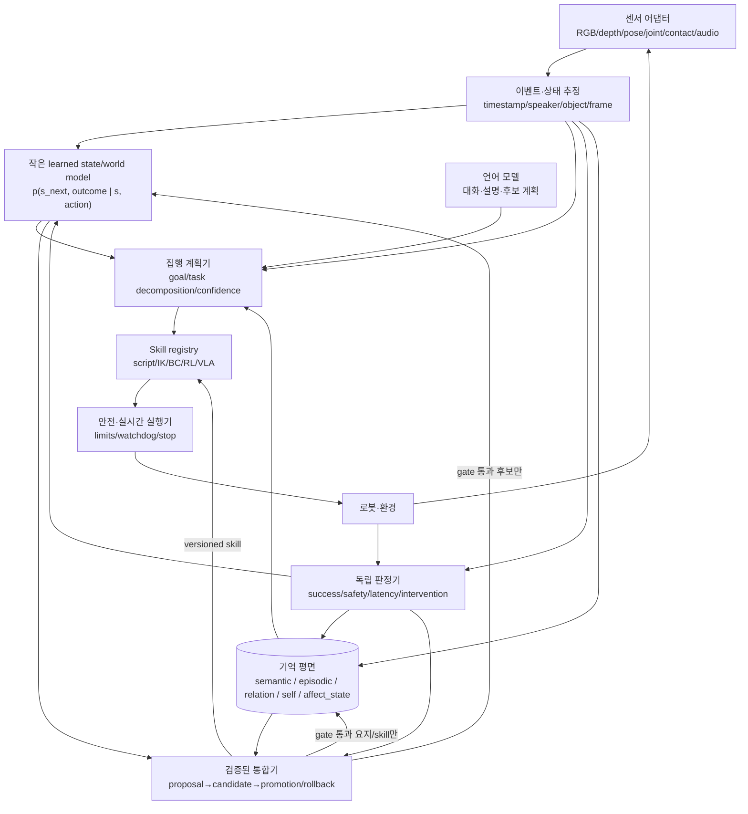

# 비비의 온보드 Physical AI 뇌 아키텍처 검토

## 결정

현재 비비의 검증 결과, 12 GB 개발 GPU, 향후 온보드·offline 목표를 함께 놓고 보면 다음 뇌는 **검사 가능한 기억 평면 + 학습된 상태/동역학 모형 + 명시적 기술(skill) 제어기 + 언어 계획기**의 혼합 구조가 가장 타당하다. 사람 뇌의 세부 구조를 그대로 복제하거나 하나의 end-to-end VLA가 기억·계획·운동·자기개선을 모두 맡기는 방안은 현재 증거로 선택할 근거가 부족하다.

핵심 학습 단위는 다음 폐루프다.

`센서 상태 s_t → 선택한 행동 a_t → 사후 외부 관측 s_(t+1)/성공·실패 → 예측오차 → 제한된 후보 업데이트 → 미래 과제 성능 검증 → 승격 또는 롤백`

비비가 사람처럼 또는 사람보다 잘한다는 주장은 범용 등급이 아니다. 과제별 성공률, 충돌/안전 위반, 완수 시간, 개입 횟수, 예측 오차, 새로운 조건으로의 일반화, 기억 회상 정확도와 같은 명시적 지표에서만 판정한다.

## 현재 증거가 강제하는 출발점

현재 코드와 프로젝트 기록은 기억·학습 부품의 존재와 성능 증명을 분리해야 한다는 것을 보여 준다.

| 현재 구성 | 확인된 범위 | 아키텍처에 주는 제약 |
|---|---|---|
| Neo4j `Experience`/`Concept` 그래프 | 장기 저장, 관계 및 제한적 Hebbian 갱신 경로가 있다 | 보존할 수 있는 기억 평면이지만, 그래프 크기나 엣지 증가를 행동 개선으로 보지 않는다 |
| `memory_gateway` | 같은 프로세스에서는 과거 경험이 응답에 반영됐으나 새 프로세스 회상 기준은 미달했다. 2026-09-11 감사에서 대화 Experience 1,508개의 embedding이 0개이고 후보가 최근 20건으로 제한됐다 | 회상 경로를 먼저 수리하고 새 프로세스/복원본 회상을 검증한다 |
| local core / sleep distill | Qwen2.5-0.5B LoRA 갱신·저장 코드는 있다 | 목적 함수가 그래프 이웃 concept replay라 자연어 질문→관련성 평가와 불일치한다. `LOCAL_CORE_DISTILL`은 계속 OFF |
| Phase 2 평가 | 과거 split에서 같은 concept pair 중복 18/250(7.2%)가 확인됐다 | 과거 MRR을 일반화 또는 자기성장 근거로 복구하지 않는다 |
| J1 adapter/base 비교 | adapter와 base 모두 질문 조건화 의미 관련성 predictor로 실패했다. actual exact target hit도 1에 머물렀다 | 더 많은 같은 distillation보다 task-aligned scorer와 독립 평가가 선행되어야 한다 |
| E2 frozen embedding | development 12문항에서 Recall@8 0.5, nDCG@8 0.291024, MRR 0.238189였다 | semantic development signal만 있으며 held-out·행동 성능·자기학습 증거가 아니다 |
| E3 검토 | top-unjudged 60행 제안 라벨은 사용자 review 대기 상태다 | 자동 negative/학습 데이터로 바꾸지 않는다. 현 시점 user label은 0 |
| B5 외부 outcome | 다음 사용자 주제 예측, 질문→답변 ranker 등에서 graph predictor가 frequency baseline을 이기지 못하거나 top-8 hit 0이었다 | action-conditioned 외부 결과를 센서/물체 상태에서 직접 수집해야 한다 |
| embodiment | pose/depth와 `NEXT_FRAME` 파이프라인은 있으나 실제 Quest 데이터와 prediction snapshot이 없다 | 감각 입력 통로의 존재를 embodied learning으로 부르지 않는다 |

이 결과는 “그래프+LLM을 버린다”는 결론이 아니다. 그래프는 출처와 시간, 화자, 사건을 검사할 수 있는 장기 기억에 적합하다. 실패한 것은 그래프 이웃을 causal-LM으로 재생하면 자연어 의미 관련성과 행동 능력이 자동으로 좋아질 것이라는 연결이다.

## 네 후보의 비교

| 후보 | 강점 | 현재 결정에 불리한 점 | 현재 총평 |
|---|---|---|---|
| A. 상세 생물학/SNN 모사 | 가소성·재생·게이팅 가설을 명시적으로 시험할 수 있음 | RTX 4070에서의 효율과 실제 robot-task 개선 근거가 없음 | 기능 원리와 향후 저전력 가속기 트랙으로 보류 |
| B. 현 graph+memory+LLM 유지 | 출처·관계·경험을 검사하고 이전하기 쉬움 | 회상 경계, 의미 scorer, action-conditioned learning이 실패 또는 미검증 | 기억·대화 기반은 유지하고 학습/행동 루프를 수리 |
| C. 혼합 learned state/world model + 기억 + skill controller | 기억 출처, 동역학 학습, 실행 안전, 부품별 소거를 분리 가능 | sensor/action/outcome 데이터와 새 판정기가 필요 | **권고안** |
| D. end-to-end VLA 중심 | 다양한 시각·언어 조건을 하나의 task policy에 활용 가능 | 데이터·VRAM·embodiment 적합성, rollback, 장기 기억, 빠른 안전 루프가 별도 필요 | 개별 기술 후보로 제한; 전체 뇌로는 보류 |

### A. 상세 생물학 또는 SNN 모사

[Spaun](https://www.science.org/doi/10.1126/science.1225266)은 약 250만 개의 spiking neuron으로 여덟 종류의 인지 과제를 한 통합 모형에서 수행해, SNN으로 큰 통합 인지 모형을 만들 수 있음을 보여 줬다. 하지만 이 결과는 카메라·관절·접촉을 가진 로봇이 경험으로 기술을 지속 개선했다는 증거가 아니다. 인간 뇌와 비슷한 구성 요소 수나 발화 양식은 과제 성공률, 안전, 일반화와 동치가 아니다.

SNN은 이벤트 카메라와 neuromorphic hardware에서 전력·지연 이점이 필요한 시점에는 가치가 있다. 현재 주어진 RTX 4070은 일반 GPU이며, 세밀한 SNN 시뮬레이션을 추가한다고 온보드 효율이 저절로 좋아지지 않는다. 따라서 놀람, 재생, 빠른 일화/느린 통계학습, 항상성 같은 **기능 원리**는 가져오되, 해부학적 모사를 전체 설계 목표로 삼지 않는다.

### B. 현재 graph + memory + LLM

이 구조의 강점은 검사 가능성이다. 어떤 경험·화자·개념이 답이나 판단에 사용됐는지 추적하고, 데이터와 모델을 분리해 2027년 2월 이전 묶음으로 옮길 수 있다. 다섯 저장소 설계도 이 장점 위에 있다.

약점은 현재 측정으로 분명하다. 회상은 세션 밖에서 약하고, embedding이 비어 있으며, local core의 학습 목적과 평가 인터페이스가 맞지 않았다. B5에서 다음 외부 결과 예측도 개선되지 않았다. LLM이 자연스러운 답을 생성하거나 그래프가 변했다는 사실을 행동 개선으로 간주하면 같은 오류가 반복된다.

### C. 혼합 구조

세계모형 계열은 행동과 미래 관측을 연결한다. [DreamerV3](https://arxiv.org/abs/2301.04104)는 learned world model 안에서 행동을 개선하는 공통 설정이 여러 도메인에서 작동할 수 있음을 보였고, [DayDreamer](https://arxiv.org/abs/2206.14176)는 같은 계열을 네 종류의 물리 로봇 온라인 학습에 적용했다. 다만 이 논문들도 비비의 평생학습, 기억 출처, 사람 관계, 안전한 자기수정을 해결하지 않는다. 비비에서는 작은 task-specific latent dynamics와 replay buffer부터 시작해야 한다.

기억은 learned latent에 전부 압축하지 않는다. [EM-LLM](https://arxiv.org/abs/2407.09450)은 surprise와 graph 기반 이벤트 경계, 유사도와 시간 인접성을 결합한 2단계 episodic retrieval로 긴 맥락을 다루지만, 언어 장기문맥 결과를 로봇 skill 학습 증거로 바꿀 수는 없다. Neo4j의 다섯 저장소는 장기 기억의 출처와 수정 이력을 맡고, world model은 짧은 시간축의 `s,a,s'` 예측을 맡는다.

고수준 계획과 저수준 실행도 분리한다. [SayCan](https://arxiv.org/abs/2204.01691)은 언어모델의 고수준 제안과 로봇이 실제로 수행 가능한지를 나타내는 value/affordance를 결합했다. 이 구조는 LLM 문장이 바로 모터 명령이 되지 않게 하는 유용한 선례다. 비비에서는 기술마다 입력 계약, 실행 전 조건, timeout, 중단 조건, 사후 성공 판정기를 둔다.

### D. end-to-end VLA

[RT-2](https://arxiv.org/abs/2307.15818)는 vision-language model을 robot action token까지 공동학습해 웹 지식의 일부를 로봇 제어로 옮겼고, [OpenVLA](https://arxiv.org/abs/2406.09246)는 7B open model을 970k real-world robot demonstration에 학습해 공개 재현 경로를 넓혔다. 이는 task-conditioned policy 후보로 중요하다. 하지만 긴 일화 기억, 출처/충돌, 지속 학습 rollback, 빠른 안전 제어를 하나의 VLA weight에 넣어 해결하지는 않는다.

7B급 모델은 12 GB에서 양자화 추론 가능성을 별도로 실측해야 하고, 안정적인 fine-tuning·동시 vision/DB/서비스 운용은 더 빡빡하다. 작은 VLA라도 실제 로봇 데이터와 action space가 맞아야 한다. 그러므로 VLA는 “집기”, “가리키기”, “이동” 같은 bounded skill의 후보로 넣고, 정해진 baseline과 shadow/제한 live gate를 통과할 때만 skill registry에 승격한다.

## 권고 아키텍처

### 1. 감각·시간 계약

병행 구현된 W6 센서 계약의 현재 식별자는 `device_id`, `session_id`, `frame_id`, 단조 증가 `frame_index`다. 이 계약과 capture/receive timestamp, 좌표계, 이동 m/회전 rad, 누락·중복·역순 판정을 그대로 감각 입력의 기준으로 쓴다. 여기서 제안하는 `episode_id`, `step_index`, `action_id`는 그 구현을 바꾸는 필드가 아니라 여러 sensor frame을 한 과제 시도와 한 행동에 묶는 **후속 W7 상위 manifest**다. 사후 결과는 행동 이후의 외부 센서에서 계산하며 같은 턴 LLM 텍스트를 정답으로 쓰지 않는다.

첫 과제는 하나로 제한한다. 예를 들어 “표식 물체를 10 cm 이내로 접근하고 멈춤” 또는 “큐브를 지정 영역으로 밀기”처럼 시작·성공·안전 조건을 센서로 판정할 수 있어야 한다. 언어 대화의 다음 주제를 예측하는 B5 목표보다 행동에 조건화되어 있어 인과 계약이 분명하다.

### 2. 두 종류의 상태

`symbolic/inspectable state`는 사람·물체·목표·이력·출처를 담당한다. `learned latent state`는 짧은 시간축의 물체 운동, 접촉 전후, 관측 누락 같은 동역학을 담당한다. 둘을 하나로 합치지 않고, 동일 `episode_id/action_id`로 연결한다.

초기 world model은 대형 생성 비디오가 아니라 수치 상태와 작은 이미지 feature를 입력으로 하는 ensemble 또는 recurrent latent model이 적합하다. 예측 대상은 다음 pose/접촉/성공 확률과 불확실성이다. 모델이 낸 영상의 시각적 사실감은 우선 지표가 아니다.

### 3. 기술 레지스트리와 제어

기술은 출처에 따라 `scripted`, `teleop/BC`, `RL`, `VLA`로 표시한다. 각 기술 버전은 관측·행동 차원, 단위, frame, joint/pose convention, 허용 범위, 예상 시간, 중단 조건, 판정기 버전, 훈련 데이터 manifest와 결박한다.

고수준 LLM/graph planner는 실행 가능한 기술 후보만 선택한다. 관절 limit, 속도/토크, 충돌, 통신 끊김과 emergency stop은 별도의 deterministic 실행기가 담당한다. 느린 모델 추론과 모터 loop를 같은 주기로 돌리지 않는다.

### 4. 다섯 저장소의 역할

2026-09-06 볼트 정본의 정확한 다섯 이름은 **semantic 의미·사람 스키마**, **episodic 일화+감정 태그**, **relation 관계·애착 상태**, **self 자기모형**, **affect_state 지금의 정서 상태**다. 이 구분은 유지하되 다음처럼 축소 적용한다.

- **semantic 의미·사람 스키마**는 Concept와 사람별 Person/Trait 스키마를 함께 두고 출처·시간·충돌을 유지한다. Person은 별도 여섯째 저장소가 아니다.
- **episodic 일화+감정 태그**는 원 관측을 복제하는 창고가 아니라 사건·행동·결과 manifest의 주소와 요약을 보관한다.
- **relation 관계·애착 상태**는 Person 사이 관계와 대상별 정서 상태를 맡고, 자동 병합·삭제 전에 proposal을 낸다.
- **self 자기모형**은 능력 추정치와 목표를 갖되 실제 평가 artifact에서만 confidence를 갱신한다.
- **affect_state 지금의 정서 상태**는 쓰기·탐색 우선순위의 후보 신호다. 소거 실험에서 단순 recent-average를 이길 때만 사용한다.
- 원 영상/대형 sensor data는 E/D에 content-addressed artifact로 두고 Neo4j에는 hash, 범위, 위치, schema version을 기록한다.

### 5. 통합과 자기개선

수면이라는 이름은 스케줄을 설명할 뿐 성공 판정이 아니다. 각 작업은 frozen input range와 candidate output을 갖고, 현재 production을 직접 덮어쓰지 않는다.

1. 처리할 experience/episode cursor와 manifest를 고정한다.
2. 재생 표본을 train/development/future lockbox로 누수 없이 분리한다.
3. 후보 memory summary, world model 또는 skill을 별도 경로에 저장한다.
4. 동일 판정기로 현재 버전과 후보를 비교한다.
5. 새 조건 개선, 기존 능력 비퇴행, 안전 gate, restart persistence를 모두 통과한 경우에만 원자적으로 승격한다.
6. 승격 manifest는 이전 버전과 rollback 명령·대상을 보존한다.

현재 `sleep_distill_job.py`의 pair-disjoint와 비퇴행 저장은 좋은 구조적 출발점이지만, link-MRR 목적은 로봇 행동 목적이 아니다. 새로운 폐루프가 생기기 전 기존 job을 켜지 않는다.

## 하드웨어·이식 제약에 맞춘 배치

개발기의 RTX 4070 12 GB는 sensor feature 추출, 작은 dynamics/actor 학습, 0.5B급 local core 실험, 소형/양자화 정책 추론을 순차로 수행할 수 있는 후보 환경이다. 동시 실행 가능성과 latency는 **확인 안 됨**이므로 VRAM, RAM, GPU utilization, p50/p95 latency를 실제로 재야 한다.

권장 프로세스 경계는 다음과 같다.

- `control-runtime`: CPU 우선, watchdog과 안전 정지. 모델 장애에도 살아 있어야 한다.
- `perception`: GPU 선택 사용, frame queue에 bounded backpressure.
- `brain-service`: memory retrieval, planner, small world model inference.
- `learning-worker`: 기본 OFF, idle/승인 gate 뒤 candidate만 만든다. runtime과 GPU 동시 점유를 피한다.
- `artifact-store`: E/D의 hash manifest, Neo4j/모델/설정/평가를 분리 백업한다.

항상 켜진 별도 host는 선택 사항이다. 로봇이 offline이어야 하는 최종 조건은 네트워크 단절 상태에서 센서→안전 제어→필수 skill→상태 저장이 동작한다는 뜻이다. Gemini/OpenAI가 없어도 이 핵심 경로가 살아야 하며, 클라우드 대화 품질은 별도 기능으로 표시한다.

2027년 2월 이전 묶음에는 source revision, lockfile, Python/Node 설치 명세, DB dump+schema/index, sensor calibration, artifact manifest, base/tokenizer/adapter revision, world model/skill checkpoints, promotion history, job cursor, secrets 전달 절차가 들어간다. `.venv`, Docker image 또는 C의 cache 자체를 유일한 복원 경로로 삼지 않는다.

## 무엇을 유지·수리·추가·보류할까

| 결정 | 대상 | 완료 기준 |
|---|---|---|
| 유지 | Neo4j Experience/Concept/Person, 출처·시간, memory gateway opt-in, Phase 1 prequential artifact, E5 pinned model snapshot | hash·schema·restore와 새 프로세스 회상 검증 |
| 수리 | embedding/backfill 경로, 실제 vector index query, 최근 20건 후보 제한, person/session 경계, readiness와 Redis | 복원본에서 동일 ID 회상, false-ready 없음 |
| 추가 | sensor/action/outcome schema, state estimator, 작은 action-conditioned model, skill registry, independent verifier, candidate promotion/rollback | 사전등록 과제의 future episode에서 baseline 개선 및 안전 비퇴행 |
| 보류 | `LOCAL_CORE_DISTILL=1`, 자동 graph cleanup/merge/delete, affect 기반 자동 강화, 범용 VLA fine-tune, 상세 SNN/whole-brain mimicry | 각각 독립 objective·데이터·resource·held-out·rollback gate가 생길 때 |

## 0–2주 실행 계획

다른 worktree의 W1/W2/E3/sensor 작업을 막지 않는다. 이 문서의 순서는 dependency다.

| 기간 | 작업 | 입력 의존성 | 종료 gate |
|---|---|---|---|
| 0–3일 | 첫 embodied task 한 개의 observation/action/outcome/stop 계약과 offline replay row 확정 | W6 sensor contract의 단위·frame·timestamp | synthetic이 아닌 실제 캡처 1 episode가 schema 검증 통과 |
| 2–5일 | deterministic/scripted skill과 독립 성공 판정기 작성 | 기기 접근 또는 이미 존재하는 실제 episode | 같은 manifest 재평가 hash 일치, 안전 한도 위반 0 |
| 4–8일 | current-state/frequency/constant baseline + 작은 one-step dynamics ensemble을 offline 비교 | 최소 train 여러 episode와 미래 development episode | 미래 episode에서 사전 지표 계산 가능; 안 되면 데이터 gate 실패로 종료 |
| 7–10일 | world-model prediction을 planner 입력으로 shadow 실행 | baseline보다 예측 지표 개선 | action은 바꾸지 않고 선택 차이·불확실성 기록 |
| 9–14일 | 제한된 low-risk live A/B와 restart persistence | shadow gate, hardware stop 검증 | 성공률/개입/안전/latency 사전 기준 통과 시 candidate skill 승격 |

첫 모델이 baseline을 이기지 못하면 architecture 실패가 아니라 해당 state/target/model 가설 실패로 기록한다. threshold를 결과에 맞춰 바꾸거나 같은 데이터를 lockbox로 재사용하지 않는다.

## 다음 마일스톤

**M1: Grounded One-Skill Loop**가 다음 통합 마일스톤이다.

- 하나의 실제 로봇 과제
- 최소 두 개의 독립 train episode 묶음과 시간상 뒤의 development 묶음
- 행동 전 prediction seal
- 행동 후 sensor-derived outcome
- scripted/frequency baseline
- candidate world model 또는 policy
- 안전·성공·latency 판정기
- restart 후 동일 version과 memory 조회
- promotion 또는 rollback artifact

M1이 통과하기 전 “비비가 스스로 로봇 행동을 개선한다”, “human-like brain”, “범용 Physical AI”라고 쓰지 않는다.

## 영상 근거

| 영상 | 확인 수준 | 사용할 수 있는 결론 |
|---|---|---|
| YouTube Shorts `u98cx_ZtPoY`, 「우리가 새로운 걸 배울 때 뇌에서 일어나는 일」 | 별도 `gpt-5.6-sol/high` 검토가 공개 영상 파일, ffprobe, 전 구간 1초 프레임, 게시 메타데이터를 직접 확인. 19.521초. 제공 자막 없음. 로컬 ASR은 품질 실패로 내용 근거에서 제외 | 경험 의존 가소성의 설명용 비유. 서로 다른 현미경 클립의 몽타주이며 사람 학습 전후 실험 또는 비비 메커니즘의 증거가 아님 |
| [DayDreamer 원 연구 페이지](https://danijar.com/project/daydreamer/)의 robot/talk iframe | 페이지의 제목·저자·CoRL 2022·초록과 영상 iframe 존재를 확인; iframe 전체 재생 시청 아님 | 네 실물 로봇의 online world-model 연구 데모. 비비 hardware에서 재현한 증거 아님 |
| [SayCan 원 연구 페이지](https://say-can.github.io/)의 실행 영상 | 페이지의 approach/results와 embedded video 사례를 확인; 영상 전체 재생 시청 아님 | LLM score와 skill affordance를 분리한 실행 사례. 현재-step value만으로는 실패 뒤 feedback이 부족하다는 저자 한계도 확인 |

영상은 아이디어를 설명하는 보조 근거다. architecture 결정과 성능 판정은 논문 방법, 코드/데이터 계약, 비비 자체 평가 artifact에 둔다.

## 서지 교차검증 결과

arXiv 검색 MCP의 초기 호출은 응답 없이 장시간 대기해 중단됐지만, 공식 arXiv 원문 페이지를 웹에서 확인한 뒤 Semantic Scholar `get_paper` 재시도는 성공했다. 아래는 2026-09-12 조회값이며 실제 `citationCount` 내림차순이다. 인용 수는 논문의 진실성을 판정하는 점수가 아니라 영향도 맥락이다.

| 순서 | 논문 | year / venue | citation / influential | 이 결정에서 지지하는 범위 | 등급 |
|---:|---|---|---:|---|---|
| 1 | [EWC](https://www.pnas.org/doi/10.1073/pnas.1611835114) | 2016 / PNAS | 10,846 / 1,458 | continual update의 망각 억제 수단; 안전·데이터 타당성 해법은 아님 | 피어리뷰 저널 |
| 2 | [Complementary Learning Systems](https://doi.org/10.1037/0033-295X.102.3.419) | 1995 / Psychological Review | 5,530 / 350 | 빠른 일화와 느린 통계 학습의 기능 분리 | 피어리뷰 저널 |
| 3 | [RT-2](https://arxiv.org/abs/2307.15818) | 2023 / CoRL | 4,117 / 233 | VLA가 web 지식과 robot action을 공동학습할 수 있음; 전체 뇌 근거는 아님 | 피어리뷰 학회 |
| 4 | [SayCan](https://arxiv.org/abs/2204.01691) | 2022 / CoRL | 3,640 / 213 | 언어 계획과 수행 가능한 skill value를 분리 | 피어리뷰 학회 |
| 5 | [OpenVLA](https://arxiv.org/abs/2406.09246) | 2024 / CoRL | 3,256 / 499 | 공개 7B VLA와 task adaptation 경로; 비비 resource 적합성은 미측정 | 피어리뷰 학회 |
| 6 | [DreamerV3](https://www.nature.com/articles/s41586-025-08744-2) | 2023 / arXiv.org | 1,386 / 182 | action-conditioned world model 안에서 actor/critic 학습 | Semantic Scholar venue는 arXiv; Nature 게재는 원문 확인 |
| 7 | [Sleep consolidation review](https://doi.org/10.1038/s41593-019-0467-3) | 2019 / Nature Neuroscience | 958 / 52 | biological replay 원리; software sleep 성공 판정은 아님 | 피어리뷰 저널 |
| 8 | [V-JEPA 2](https://arxiv.org/abs/2506.09985) | 2025 / arXiv.org | 679 / 99 | video representation과 action-conditioned planning 가능성 | venue 확인 안 됨 |
| 9 | [DayDreamer](https://arxiv.org/abs/2206.14176) | 2022 / CoRL | 570 / 26 | 네 실물 로봇의 online world-model 학습 | 피어리뷰 학회 |
| 10 | [Spaun](https://www.science.org/doi/10.1126/science.1225266) | 2012 / Science | 388 / 26 | 큰 통합 SNN 가능성; physical lifelong learning 증거는 아님 | 피어리뷰 저널 |
| 11 | [EM-LLM](https://arxiv.org/abs/2407.09450) | 2024 / ICLR | 67 / 6 | event-bounded episodic retrieval; robot skill 결과는 아님 | **[peer-reviewed]** top-tier venue |

DayDreamer는 단일 논문 심층 확인 대상으로 `get_paper_references`와 `get_paper_citations`도 호출했다. 반환된 10개 reference 표본에는 model-free real-world locomotion, visual model-based RL, R3M, safe locomotion 등이 있었고, citation 표본에는 2026년 후속 world-model/robotics 연구가 있었다. 이 관계망은 DayDreamer가 physical online learning의 직접 선례임을 보강하지만, 비비의 장기 기억·안전·승격 계약을 제공하지는 않는다.

## 근거의 한계

- citation/venue 값은 2026-09-12 Semantic Scholar 조회 스냅샷이며 바뀔 수 있다. DreamerV3처럼 arXiv ID 조회가 journal venue를 반영하지 않는 경우가 있다.
- 최신 모델의 크기, 12 GB에서의 latency, 로봇별 성공률은 장치·양자화·runtime에 따라 달라진다. 이 문헌 리뷰는 설치·다운로드·학습·DB/API mutation을 수행하지 않았다.
- 2026-09-06 다섯 저장소 설계의 일부 threshold와 뇌 대응은 공학적 가설이다. 저장소 이름이 생물학적으로 그럴듯하다는 것만으로 효과를 인정하지 않는다.

## Sources

1. Eliasmith et al. “[A Large-Scale Model of the Functioning Brain](https://www.science.org/doi/10.1126/science.1225266).” *Science*, 2012. Spaun의 통합 SNN 과제 수행; 로봇 평생학습 증거는 아님.
2. Hafner et al. “[Mastering Diverse Domains through World Models](https://arxiv.org/abs/2301.04104).” arXiv:2301.04104; *Nature*, 2025. DreamerV3.
3. Wu et al. “[DayDreamer: World Models for Physical Robot Learning](https://arxiv.org/abs/2206.14176).” arXiv:2206.14176; CoRL, 2022.
4. Fountas et al. “[Human-inspired Episodic Memory for Infinite Context LLMs](https://arxiv.org/abs/2407.09450).” arXiv:2407.09450; ICLR, 2025. EM-LLM.
5. Ahn et al. “[Do As I Can, Not As I Say: Grounding Language in Robotic Affordances](https://arxiv.org/abs/2204.01691).” arXiv:2204.01691; CoRL, 2022. SayCan.
6. Brohan et al. “[RT-2: Vision-Language-Action Models Transfer Web Knowledge to Robotic Control](https://arxiv.org/abs/2307.15818).” arXiv:2307.15818; CoRL, 2023.
7. Kim et al. “[OpenVLA: An Open-Source Vision-Language-Action Model](https://arxiv.org/abs/2406.09246).” arXiv:2406.09246; 2024.
8. Assran et al. “[V-JEPA 2: Self-Supervised Video Models Enable Understanding, Prediction and Planning](https://arxiv.org/abs/2506.09985).” arXiv:2506.09985, 2025. Semantic Scholar는 venue를 arXiv.org, citation/influential을 679/99로 반환했다.
9. Kirkpatrick et al. “[Overcoming Catastrophic Forgetting in Neural Networks](https://www.pnas.org/doi/10.1073/pnas.1611835114).” *PNAS*, 2017. EWC; 완전한 continual-learning 해결책은 아님.
10. McClelland, McNaughton & O’Reilly. “[Why There Are Complementary Learning Systems in the Hippocampus and Neocortex](https://doi.org/10.1037/0033-295X.102.3.419).” *Psychological Review*, 1995. 빠른 일화/느린 통계 학습의 이론적 근거.
11. Klinzing, Niethard & Born. “[Mechanisms of Systems Memory Consolidation during Sleep](https://doi.org/10.1038/s41593-019-0467-3).” *Nature Neuroscience*, 2019. 수면 통합의 생물학적 근거; software job의 성공 판정은 아님.
12. Meta AI. “[V-JEPA 2: Teaching Machines to Understand and Predict the Physical World](https://ai.meta.com/blog/v-jepa-2-world-model-benchmarks/).” 2025. 공식 연구/데모 페이지.

프로젝트 근거: `AGENTS.md`, `claudedocs/deployment/BIBI_RD_PRIORITY_PLAN_2026-09-11.md`, `claudedocs/research/MEMORY_GATEWAY_A0_A_2026-09-06.md`, J1/E2/E3/B5 JSON, `PHASE2_SLEEP_DISTILL_2026-07-13.md`, `EMBODIMENT_PIPELINE_2026-07-12.md`, `neural/baby/memory_gateway.py`, `scripts/research/sleep_distill_job.py`. 볼트 근거는 읽기 전용으로 확인한 `A2A/비비 다음 뇌 설계 — VoiceMem 좌·우뇌를 넘어서 (2026-09-06).md`다.
